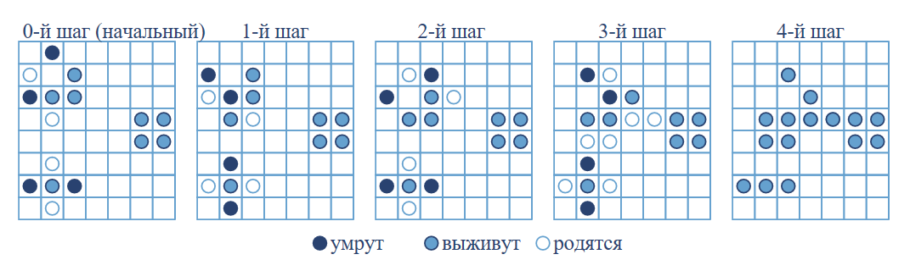

Описание
--------

Каждое задание представляет из себя отдельный JS файл, в котором вам необходимо дописать тело
одной (или нескольких) функций. Данная функция должна решать задачу, поставленную в условии. При запуске
JS файла в браузере в консоле будут выведены результаты прохода тестов:


    - Right triangle case
    - Equilateral triangle case
    - Third case
    + Fourth case
    + Zero side case`
    Done!


Результат показывает, что первые три теста не прошли (ваш код выдал неверный результат), а последние
два успешно прошли. Задание считается законченным когда все тесты прошли успешно.

Разминка
--------
Дан массив чисел. Найти максимальное значение, минимальное и среднеарифметическое значение.

**Например:** дла массива `[18, 12, 98, 38, 13, 2, 54, 60, 77, 52]` максимальное значение - 98, минимальное - 2, среднеарифметическое - 42.4.

```javascript
getStats([3, 37, 45, 80, 1, 50, 36, 75, 77, 26]) == [98, 2, 42.4];
getStats([86, 30, 70, 19, 68, 75, 10, 49, 26, 37]) == [86, 10, 47];
```

Задача 1
--------
Дан массив чисел. Нужно найти сумму элементов с четными индексами (0-й, 2-й, 4-й и т.д.), затем умножить эту сумму на последний элемент исходного массива. Не забудьте, что элементы массива нумеруются от 0.

Для пустого массива результат всегда должен быть 0.

**Входные данные:** Массив чисел.

**Выходные данные:** Число.

Примеры:

```javascript
calcSum([0, 1, 2, 3, 4, 5]) == 30;
calcSum([1, 3, 5]) == 30;
calcSum([6]) == 36;
calcSum([]) == 0;
```

Задача 2
--------
Дан массив. Убрать из него все повторяющиеся элементы, сохранив исходный порядок значений.

**Например:** дан массив `Q = [10, 22, 14, 10, 28, 10, 14, 62, 32]`. Значения 10 и 14 встречаются несколько раз,
и нужно их убрать. В результате получим массив `A = [22, 28, 62, 32]`.

Примеры:

```javascript
filterUnique([10, 22, 14, 10, 28, 10, 14, 62, 32]) == [22, 28, 62, 32];
filterUnique([3, 14, 15, 92, 6, 5, 35]) == [3, 14, 15, 92, 6, 5, 35];
filterUnique([8, 2, 2, 3, 8, 2, 2, 3]) == [];
```

Задача 3
--------
Подсчитать самый часто встречающийся символ в строке. Если таких букв несколько, то нужно вернуть любую.

Например, дана строка "CAATGCCATA". Частота букв следующая

* "A" - 4 шт
* "С" - 3 шт
* "T" - 2 шт
* "G" - 1 шт

Самая часто встречающаяся буква - "A". Поэтому ответ будет "A".

Примеры:

```javascript
getTopLetter("CAATGCCATA") == "A";
getTopLetter("M7X72DRLlhMBHJzcTROVhy2xPYfVVoyWp9djVkR3FDYo4vsvRUyaq8WBKEk9Igdx") == "V";

var song = "I'm gonna fight 'em off\n" +
           "A seven nation army couldn't hold me back\n" +
           "They're gonna rip it off\n" +
           "Taking their time right behind my back\n" +

           "And I'm talking to myself at night\n" +
           "Because I can't forget\n" +
           "Back and forth through my mind\n" +
           "Behind a cigarette\n" +

           "And the message coming from my eyes\n" +
           "Says leave it alone";

song = song.replace(/ /g, ''); //Уберём все пробелы
getTopLetter(song) == "e";
```

Задача 4
--------
Дана матрица (может быть как квадратная, так и прямоугольная). Написать функцию, которая создаёт транспонированную матрицу.

**Входные данные:** двумерный массив.

**Выходные данные:** двумерный массив.

Примеры:

```javascript
getTransposed([["A", "C"],
               ["T", "G"]]) == [["A", "T"],
                                ["C", "G"]]
getTransposed([[-2, -1, 0, 1],
               [-1,  0, 1, 2],
               [ 0,  1, 2, 3]]) == [[-2, -1, 0],
                                    [-1,  0, 1],
                                    [ 0,  1, 2],
                                    [ 1,  2, 3]]
```

Задача 5
--------
Дан массив объектов. Создать новый объект, в котором будут объединяться все поля исходных объектов. Значения полей должны объединяться в массивы с перечислением значений исходных данных.

Например, пусть есть три объекта:

```javascript
var package0 = {'name': 'boots', 'weight': 10.3, 'price': 122, 'fragile': false, 'owner': 'Michael Caine'};
var package1 = {'price': 31.5, 'fragile': true, 'owner': 'Tom Cruise', 'address': 'Washington DC, Ave. 144/5'};
var package2 = {'price': 103.25, 'charged': true, 'fromCountry': 'India', 'volume': '10 L'};
var result = mergeObjects([package0, package1, package2]);
```

После объединения этит объектов получится JavaScript объект:

```javascript
var result = {
    name: ['boots'],
    weight: [10.3],
    price: [122, 31.5, 103.25],
    fragile: [false, true],
    owner: ['Michael Caine', 'Tom Cruise'],
    address: ['Washington DC, Ave. 144/5'],
    charged: [true],
    fromCountry: ['India'],
    volume: ['10 L']
};
```

Задача 6 "Что наша жизнь? Игра!" (\*)
------------
[Игра "Жизнь"](https://ru.wikipedia.org/wiki/Жизнь_%28игра%29) - это "игра" или клеточный автомат, придуманный английским математиком Джоном Конвеем в 1970 году. Назвать игрой это можно, но это игра без участия игрока. Весь ход "игры" определяется только начальным состоянием. Игрок не принимает прямого участия в игре, а лишь расставляет или генерирует начальную конфигурацию "живых" клеток, которые затем взаимодействуют согласно правилам уже без его участия (он является наблюдателем).

Место действия этой игры — "вселенная" — это размеченная на клетки поверхность или бесконечная плоскость. Каждая клетка на этой поверхности может находиться в двух состояниях: быть "живой" или быть "мёртвой" (пустой). Клетка имеет восемь соседей (окружающих клеток).

Распределение живых клеток в начале игры называется первым поколением. Каждое следующее поколение рассчитывается на основе предыдущего по таким правилам:

- в пустой (мёртвой) клетке, рядом с которой ровно три живые клетки, зарождается жизнь;
- если у живой клетки есть две или три живые соседки, то эта клетка продолжает жить;
- в противном случае (если соседей меньше двух или больше трёх) клетка умирает ("от одиночества" или "от перенаселённости")

Игра прекращается, если на поле не останется ни одной "живой" клетки, если при очередном шаге ни одна из клеток не меняет своего состояния (складывается стабильная конфигурация) или если конфигурация на очередном шаге в точности (без сдвигов и поворотов) повторит себя же на одном из более ранних шагов (складывается периодическая конфигурация).

Начальная расстановка (или 0-ой шаг) определяет начальное состояние системы. Первое поколение получается путем применения описанных правил одновременно ко всем клеткам. Момент перехода есть ход в игре. Далее мы последовательно повторяем данную процедуру.

В этой задаче вам нужно будет подсчитать сколько живых клеток будет на поле на N-ом ходе. В нашем случае мы не прекращаем игру даже если видим повторы или пустое поле. Дана изначальная позиция, как матрица и интересующий номер шага N. Матрица представлена, как двумерный массив, где 1 - это живая клетка и 0 - пустая. И не забудьте что "вселенная" **бесконечна**.



Представленный пример будет описан следующим массивом:

```javascript
[[0, 1, 0, 0, 0, 0, 0],
 [0, 0, 1, 0, 0, 0, 0],
 [1, 1, 1, 0, 0, 0, 0],
 [0, 0, 0, 0, 0, 1, 1],
 [0, 0, 0, 0, 0, 1, 1],
 [0, 0, 0, 0, 0, 0, 0],
 [1, 1, 1, 0, 0, 0, 0]]
```

И если нам нужно подсчитать число живых клеток на 4-ом ходе, то как мы видим на изображении, ответ будет 15.

**Входные данные:** Два аргумента. Начальное состояние, как массив массивов с числами 1 и 0. И номер шага, как целое число.

**Выходные данные:** Число живых клеток на N-ом шаге, как число.

Примеры:

```javascript
lifeCounter([[0, 1, 0, 0, 0, 0, 0],
             [0, 0, 1, 0, 0, 0, 0],
             [1, 1, 1, 0, 0, 0, 0],
             [0, 0, 0, 0, 0, 1, 1],
             [0, 0, 0, 0, 0, 1, 1],
             [0, 0, 0, 0, 0, 0, 0],
             [1, 1, 1, 0, 0, 0, 0]], 4) == 15
```

**Совет:** используйте классы Set и Map. Не создавайте массивов и матриц.

Задача 7 "Пешки атакуют" (*) 
----------------------------

На шахматной доске стоят несколько белых пешек. Напоминаю, что пешка может бить только по диагонали на одну 
клетку: вперёд и вправо, или вперёд и влево. Некоторые из расположенных пешек прикрывают другие пешки на доске.
Необходимо написать функцию, которая будет подсчитывать количество прикрытых пешек на доске.

Например, пусть белые пешки расположены следующим образом

```
8 . . . . . . . .    i - пешка
7 . . . . . . . .    . - пустая клетка
6 . . . . . . . .
5 . . . . . . i .
4 . i . i . i . .
3 . . i . i . . .
2 . . . i . . . .
1 . . . . . . . .
  a b c d e f g h
```

- Пешка d2 прикрывает две пешки с3 и e3.
- Пешка c3 прикрывает две пешки b4 и d4.
- Пешка e3 прикрывает две пешки d4 и f4.
- Пешка f4 прикрывает пешку g5.
- Пешки b4, d4, g5 никого не прикрывают.

Ответ - 6 пешек прикрыто другими пешками.

**Входные данные:** множество (Set) строк с координатами пешек.

**Выходные данные:** число.

Примеры:

```javascript
getSafePawns(Set(["b4", "d4", "f4", "c3", "e3", "g5", "d2"])) == 6; //Расположение пешек из примера выше
getSafePawns(Set(["b4", "c4", "d4", "e4", "f4", "g4", "e5"])) == 1;
getSafePawns(Set(["b2", "h8"])) == 0;
```

**Совет:** используйте класс Set.
